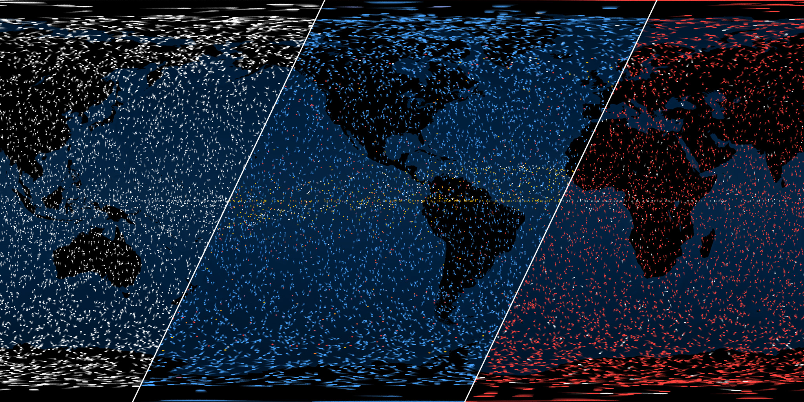

# SOS Dataset Generator: Orbiting Objects

This cloud-based set of scripts is designed to generate three [Science On a Sphere](http://sos.noaa.gov/What_is_SOS/index.html) datasets at "the push of a button". Originally created as a one-off project, traffic around our Earth is changing frequently, creating a desire to make this simpler to update for my team at the [Space Foundation](http://www.spacefoundation.org). 

## Work-in-progress

This project is not in a usable state yet. I'm in the process of migrating scripts from a local manual-ish process to an automated cloud-based solution. I'll post components as they become usable.

## Datasets

This solution generates three animated datasets:

- All unclassified objects orbiting the Earth
- Objects by altitude
- Active objects vs. inactive objects

## Todo

Lots, including a todo list. Stay tuned.

## Legal

MIT License

Copyright (c) 2016 Christopher Stevens (www.christopherstevens.cc)

Permission is hereby granted, free of charge, to any person obtaining a copy
of this software and associated documentation files (the "Software"), to deal
in the Software without restriction, including without limitation the rights
to use, copy, modify, merge, publish, distribute, sublicense, and/or sell
copies of the Software, and to permit persons to whom the Software is
furnished to do so, subject to the following conditions:

The above copyright notice and this permission notice shall be included in all
copies or substantial portions of the Software.

THE SOFTWARE IS PROVIDED "AS IS", WITHOUT WARRANTY OF ANY KIND, EXPRESS OR
IMPLIED, INCLUDING BUT NOT LIMITED TO THE WARRANTIES OF MERCHANTABILITY,
FITNESS FOR A PARTICULAR PURPOSE AND NONINFRINGEMENT. IN NO EVENT SHALL THE
AUTHORS OR COPYRIGHT HOLDERS BE LIABLE FOR ANY CLAIM, DAMAGES OR OTHER
LIABILITY, WHETHER IN AN ACTION OF CONTRACT, TORT OR OTHERWISE, ARISING FROM,
OUT OF OR IN CONNECTION WITH THE SOFTWARE OR THE USE OR OTHER DEALINGS IN THE
SOFTWARE.
